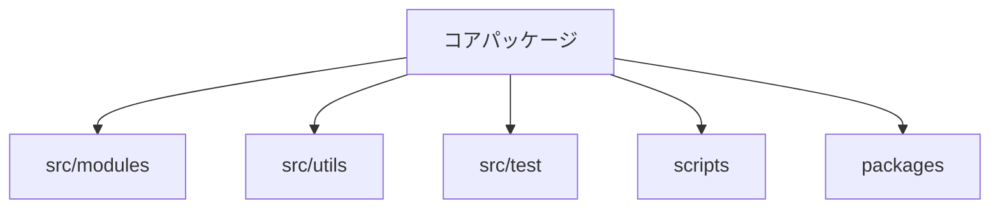
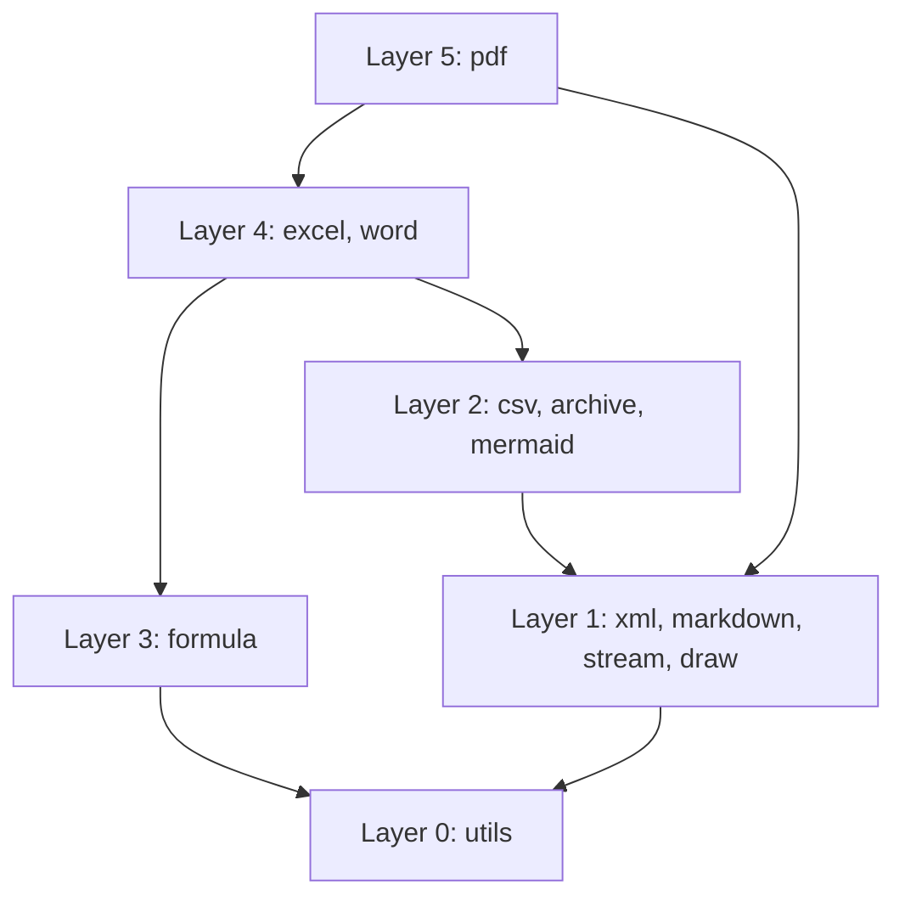

# アーキテクチャ資料

本書はリポジトリの公開アーキテクチャを説明します。追跡対象のソースから検証できるプロジェクト
情報だけを含み、認証情報、個人情報、ローカルパス、ホスト情報、非公開サービス名、デプロイ設定は
意図的に除外しています。

## 概要

ルートパッケージは実行時依存ゼロの TypeScript 文書処理ツールキットです。任意のワークスペース
パッケージは独自の依存を持てますが、コアには公開エントリポイント経由でのみアクセスします。

| 項目                 | 値                                         |
| -------------------- | ------------------------------------------ |
| 実行時依存           | 0                                          |
| モジュール数         | 11                                         |
| 公開エントリポイント | 19                                         |
| 数式関数             | 448                                        |
| パッケージ形式       | ESM のみ（CommonJS からは `require(esm)`） |

## リポジトリ構成

リポジトリのルートがコアパッケージです。補助パッケージは `packages/` に置き、実装、共有
ユーティリティ、テスト、検証スクリプトは別々のトップレベルディレクトリに置きます。

### パッケージ境界

ワークスペースパッケージは公開 exports マップを通してコアを参照します。ソースエイリアスや
`src/` への相対パスは使いません。`scripts/verify-package-imports.ts` がこの境界を強制します。

## 依存レイヤー

production モジュールは下位レイヤーだけを import できます。登録済みのブリッジ例外を除き、同じ
レイヤーや上位レイヤーへの import はできません。

### ブリッジ例外

登録されたブリッジファイルは 5 つだけです。正式な一覧は `scripts/verify-layers.ts` の
`EXCEPTIONS` マップにあり、`pnpm verify:layers` がそれ以外の上向き・横向き import を拒否します。

| 境界            | 用途                     |
| --------------- | ------------------------ |
| PDF から Excel  | ブックとチャートの描画   |
| PDF から Word   | 文書のレイアウトと描画   |
| Word から Excel | 埋め込みブックのサポート |

## 描画パイプライン

プロデューサは `DrawList` を作ります。共有 walker が変換を適用し、SVG、ラスタ、PDF の surface
へ描画操作を送ります。

### Surface 境界

| Surface | 出力           |
| ------- | -------------- |
| SVG     | マークアップ   |
| ラスタ  | RGBA ピクセル  |
| PDF     | ページ描画命令 |

描画モジュールは PNG ではなくピクセルを返します。PNG のエンコードは DEFLATE と CRC-32 を使う
ため、archive モジュールに置かれます。

## フォントパイプライン

共有 TrueType パーサとフォント探索は `src/utils` にあります。draw、PDF、Word は共有パーサを
複製せず、各出力形式に固有の処理だけを追加します。

### ブラウザでの動作

ブラウザビルドはホストのフォントファイルを探索できません。プラットフォーム別実装が安全な
ブラウザ版を提供し、呼び出し側は公開 API からフォントバイトを明示的に渡すこともできます。

## ビルド成果物

ESM と型宣言のツリーがパッケージ成果物です。IIFE bundle はモジュールバンドラを使わない
ブラウザ向けです。

### プラットフォーム別実装

Node 実装は `*.browser.ts` の兄弟ファイルを持てます。ビルドツールはパッケージの platform
condition 経由で import を結び、検証はブラウザ bundle に Node 専用実装が残らないことを確認します。

## 品質ゲート

| コマンド                | 対象                                 |
| ----------------------- | ------------------------------------ |
| `pnpm check`            | 型、lint、整形、アーキテクチャ、文書 |
| `pnpm test`             | 挙動テスト                           |
| `pnpm verify:treeshake` | 公開エントリポイントの bundle 境界   |

### テストの配置

テストは対象コードの近くに置きます。Node API が必要なテストには `*.node.test.ts` 接尾辞を付け、
ブラウザ側のテスト探索が明示的に除外できるようにします。

## 安全な文書

アーキテクチャ文書が説明するのはリポジトリの契約であり、作者や runner の環境ではありません。

### 情報方針

認証情報、秘密、個人識別子、絶対ローカルパス、非公開ネットワークアドレス、非公開リポジトリ名、
顧客データ、マシン固有の一覧を含めません。リポジトリ相対パスと一般的な例を使い、変化する件数は
本文だけを信用せずテストから導出します。
