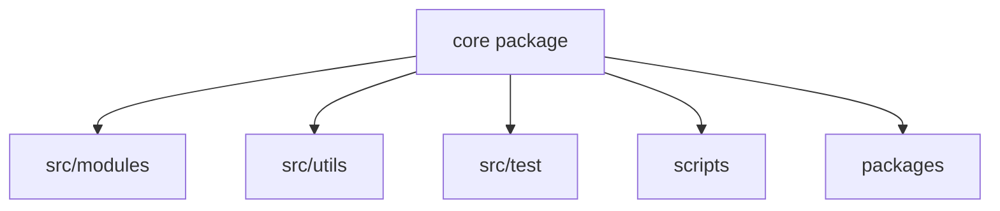
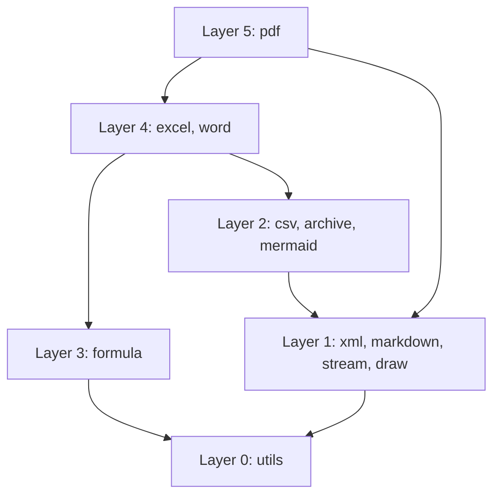

# Architecture Reference

This document describes the public architecture of the repository. It contains only
project-level information that can be verified from tracked source files. It intentionally
excludes credentials, personal data, local paths, host details, private service names, and
deployment configuration.

## Overview

The root package is a zero-runtime-dependency TypeScript toolkit for document processing.
Optional workspace packages may have their own dependencies, but they consume the core only
through published entry points.

| Property               | Value                                            |
| ---------------------- | ------------------------------------------------ |
| Runtime dependencies   | 0                                                |
| Module count           | 11                                               |
| Published entry points | 19                                               |
| Formula functions      | 448                                              |
| Package type           | ESM only (`require(esm)` for CommonJS consumers) |

## Repository Layout

The root is the core package. Supporting packages live under `packages/`; implementation,
shared utilities, tests, and verification scripts have separate top-level directories.

### Package Boundary

Workspace packages import the core through its public export map. They do not import source
aliases or reach into `src/` by relative path. `scripts/verify-package-imports.ts` enforces
this boundary.

## Dependency Layers

Production modules may import lower layers, but not peer or higher layers unless a documented
bridge exception applies.

### Bridge Exceptions

Exactly five bridge files are registered exceptions. The authoritative list is the
`EXCEPTIONS` map in `scripts/verify-layers.ts`; `pnpm verify:layers` rejects other upward or
sideways imports.

| Boundary      | Purpose                       |
| ------------- | ----------------------------- |
| PDF to Excel  | Workbook and chart rendering  |
| PDF to Word   | Document layout and rendering |
| Word to Excel | Embedded workbook support     |

## Drawing Pipeline

Producers create a `DrawList`. A shared walker applies transforms and dispatches drawing
operations to SVG, raster, or PDF surfaces.

### Surface Boundary

| Surface | Output                  |
| ------- | ----------------------- |
| SVG     | Markup                  |
| Raster  | RGBA pixels             |
| PDF     | Page drawing operations |

The drawing module returns pixels rather than encoded PNG data. PNG encoding remains with the
archive module because it uses DEFLATE and CRC-32.

## Font Pipeline

Shared TrueType parsing and font discovery live in `src/utils`. Drawing, PDF, and Word add
their own output-specific behavior without duplicating the shared parser.

### Browser Behavior

Browser builds cannot discover host font files. Platform variants provide browser-safe
implementations, while callers may supply font bytes explicitly through public APIs.

## Build Outputs

The ESM and declaration trees form the package output. IIFE bundles support browser use
without a module bundler.

### Platform Variants

A Node implementation may have a `*.browser.ts` sibling. Build tooling links imports through
the package's platform condition, and verification checks that browser bundles do not retain
Node-only implementations.

## Quality Gates

| Command                 | Scope                                                    |
| ----------------------- | -------------------------------------------------------- |
| `pnpm check`            | Types, lint, formatting, architecture, and documentation |
| `pnpm test`             | Behavioral tests                                         |
| `pnpm verify:treeshake` | Public entry-point bundle boundaries                     |

### Test Placement

Tests are colocated with the code they cover. Tests that require Node APIs use the
`*.node.test.ts` suffix so browser test discovery can exclude them explicitly.

## Safe Documentation

Architecture documentation should describe repository contracts, not an author's or runner's
environment.

### Information Policy

Do not include credentials, secrets, personal identifiers, absolute local paths, private
network addresses, private repository names, customer data, or machine-specific inventories.
Use repository-relative paths and generic examples. Derive changing counts in tests rather
than trusting prose alone.
