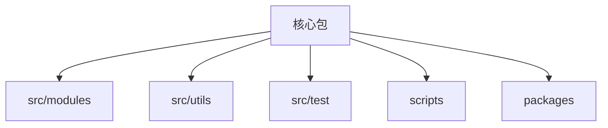
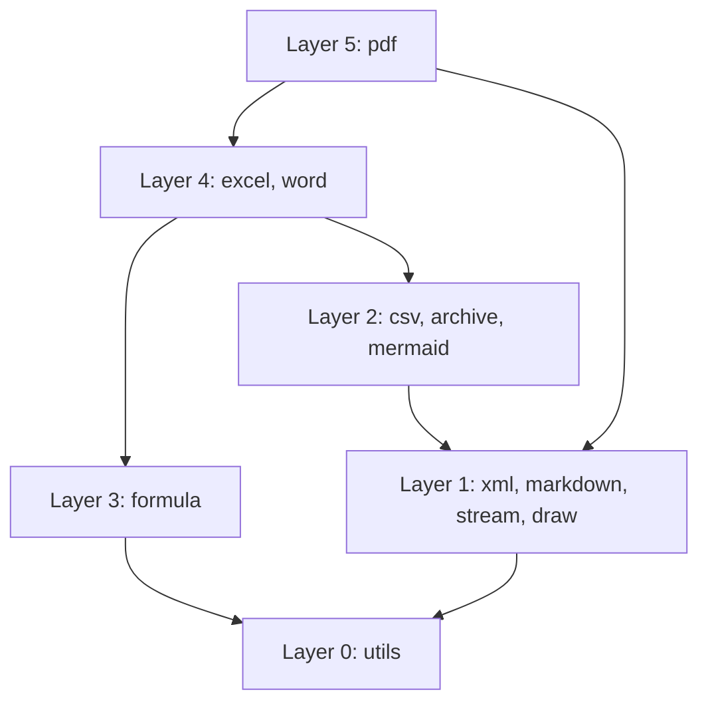

# 架构参考

本文说明仓库的公开架构，只包含能从已跟踪源码直接验证的项目级信息。文档刻意排除凭据、个人
信息、本地路径、主机细节、私有服务名称和部署配置。

## 概览

根包是一个零运行时依赖的 TypeScript 文档处理工具库。可选的工作区包可以拥有自己的依赖，但
只能通过公开入口使用核心包。

| 项目       | 值                                          |
| ---------- | ------------------------------------------- |
| 运行时依赖 | 0                                           |
| 模块数     | 11                                          |
| 公开入口   | 19                                          |
| 公式函数   | 448                                         |
| 包形态     | 仅 ESM（CommonJS 通过 `require(esm)` 使用） |

## 仓库布局

仓库根目录是核心包。辅助包位于 `packages/`，实现、共享工具、测试和验证脚本分别位于独立的
顶层目录。

### 包边界

工作区包通过公开导出映射引用核心包，不使用源码别名，也不以相对路径进入 `src/`。
`scripts/verify-package-imports.ts` 强制执行这一边界。

## 依赖分层

生产模块可以引用更低层；除已登记的桥接例外外，不得横向或向上引用。

### 桥接例外

登记为例外的桥接文件恰好 5 个。权威清单位于 `scripts/verify-layers.ts` 的 `EXCEPTIONS`
映射中；`pnpm verify:layers` 会拒绝其他向上或横向引用。

| 边界          | 用途             |
| ------------- | ---------------- |
| PDF 到 Excel  | 工作簿和图表渲染 |
| PDF 到 Word   | 文档布局和渲染   |
| Word 到 Excel | 嵌入工作簿支持   |

## 绘图流水线

生产者创建 `DrawList`。共享 walker 应用变换，并把绘图操作分发给 SVG、光栅或 PDF surface。

### Surface 边界

| Surface | 输出         |
| ------- | ------------ |
| SVG     | 标记文本     |
| 光栅    | RGBA 像素    |
| PDF     | 页面绘图操作 |

绘图模块返回像素而不是编码后的 PNG。PNG 编码依赖 DEFLATE 和 CRC-32，因此保留在归档模块。

## 字体流水线

共享 TrueType 解析和字体发现位于 `src/utils`。绘图、PDF 和 Word 在不复制共享解析器的前提下
增加各自输出格式所需的行为。

### 浏览器行为

浏览器构建无法发现主机字体文件。平台变体提供浏览器安全实现；调用方也可以通过公开 API
显式提供字体字节。

## 构建产物

ESM 与声明目录构成包产物。IIFE bundle 用于没有模块打包器的浏览器场景。

### 平台变体

Node 实现可以拥有一个 `*.browser.ts` 兄弟文件。构建工具通过包的平台条件链接 import，验证
脚本则确保浏览器 bundle 不会保留 Node 专用实现。

## 质量关卡

| 命令                    | 范围                         |
| ----------------------- | ---------------------------- |
| `pnpm check`            | 类型、lint、格式、架构和文档 |
| `pnpm test`             | 行为测试                     |
| `pnpm verify:treeshake` | 公开入口的 bundle 边界       |

### 测试位置

测试与被测代码放在一起。需要 Node API 的测试使用 `*.node.test.ts` 后缀，使浏览器测试发现
机制能够明确排除它们。

## 安全文档

架构文档应描述仓库契约，而不是作者或运行器的环境。

### 信息策略

不要包含凭据、秘密、个人标识、绝对本地路径、私有网络地址、私有仓库名称、客户数据或机器
专属清单。使用仓库相对路径和通用示例，并通过测试推导会变化的计数，而不是只相信正文。
